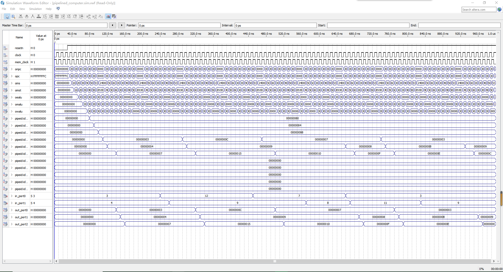
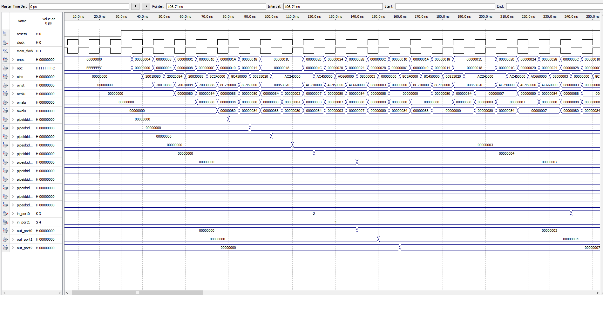
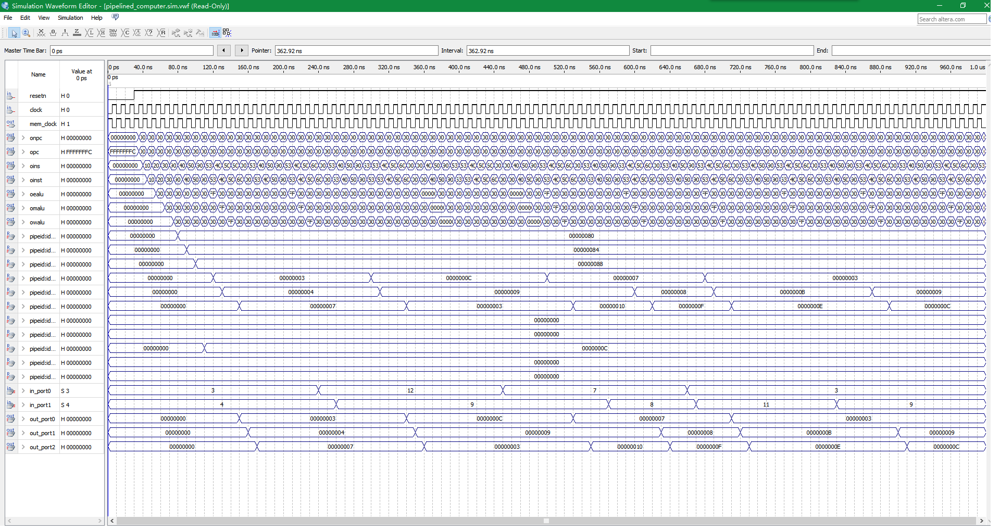
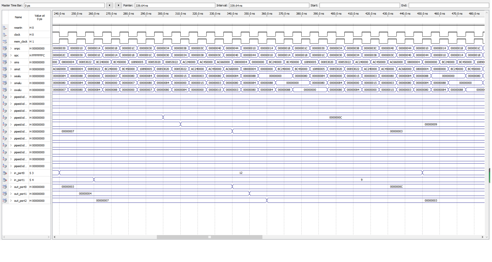
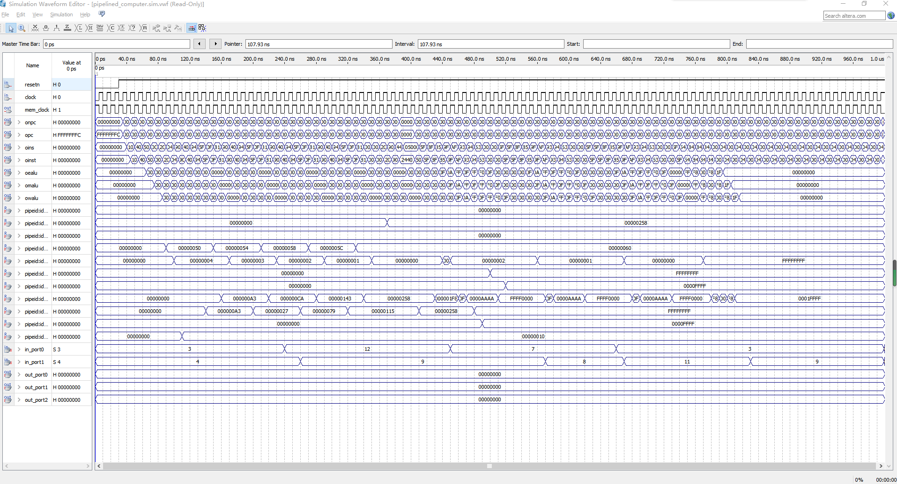
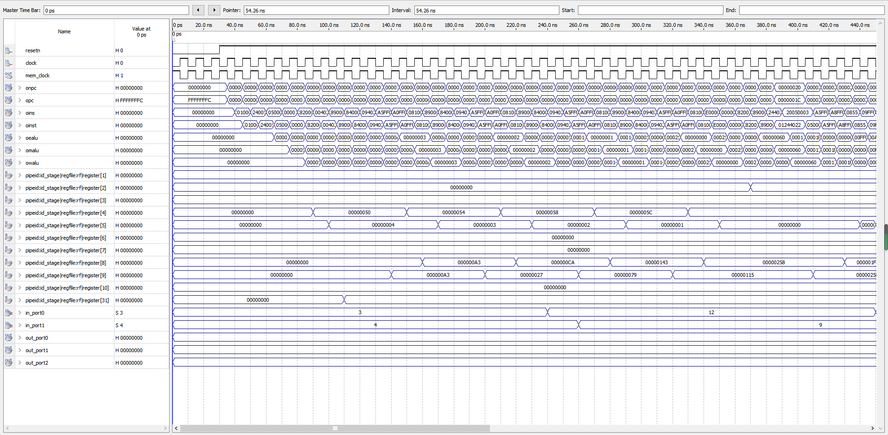
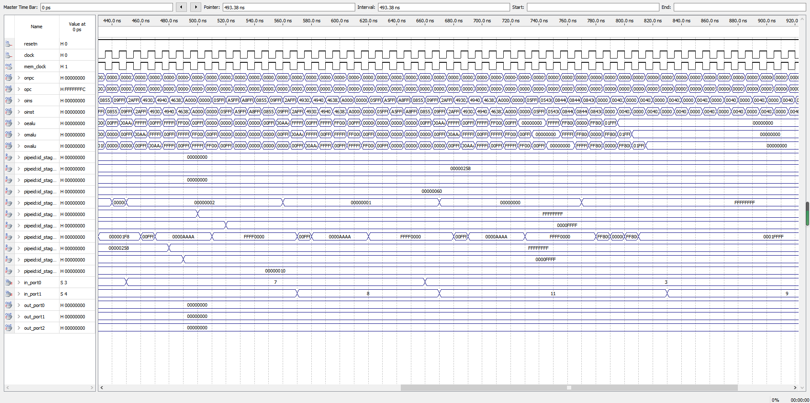
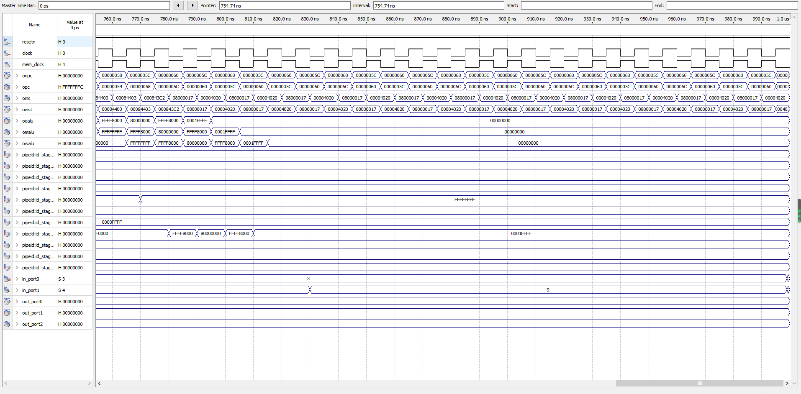

# 五段流水线CPU设计

## 实验目的

1. 理解计算机指令流水线的协调工作原理，初步掌握流水线的设计和实现原理。
2.  深刻理解流水线寄存器在流水线实现中所起的重要作用。
3.  理解和掌握流水段的划分、设计原理及其实现方法原理。
4.  掌握运算器、寄存器堆、存储器、控制器在流水工作方式下，有别于实验一的设计和实现方法。
5. 掌握流水方式下，通过 I/O 端口与外部设备进行信息交互的方法。  

## 实验特殊说明

1. 本次实验的 $beq$ 和 $bne$ 跳转在 $ID$ 阶段完成，因此移除了顶层设计中的 $zero$ 信号。
2. 本次实验没有采用转移延迟槽的设计而实采用 $bubble$ 信号解决 $ ben $ 等跳转信号产生的控制冒险，因此本次实验采用的 $insmem.mif$ 中跳转语句的后方无需插入 $sll$ 语句进行停顿。
3. 本次实验 $wpcir$ 信号位高电平有效。

## 实验思路和代码实现

### $pipepc$ 实现

$pipepc$ 的作用是获取下一条即将执行的指令的 $pc$ 值。该模块由时钟驱动，在时钟的上升沿处更新 $pc$ 值。在 $reset$ 信号出现时，将 $pc$ 值设为无效的 -4，同时方便在一个周期后进入重新从 $pc=0$ 处读取指令开始执行。同时 $wpcir$ 信号决定是否对 $pc$ 的值进行更新，以解决由 $lw$ 指令造成的数据冒险。

```verilog
module pipepc(newpc, wpcir, clock, resetn, pc);
	input [31:0] newpc;
	input resetn, wpcir, clock;
	output reg [31:0] pc;
	always @(posedge clock or negedge resetn)
	begin
		if(resetn == 0)
		begin
			pc <= -4;
		end
		else
			if(wpcir != 0)
			begin
				pc <= newpc;
			end
	end
endmodule 
```


### $pipeif$ 实现

$pipeif$ 阶段实现的是根据 $pc$ 值从指令ROM中取出指令。同时该阶段还将定义一个32位四选一多选器，根据控制单元给出的 $pcsource$ 决定下一条指令 $pc$ 值的来源。$bpc$ 是 $beq$ 合 $bne$ 指令跳转的下一条指令地址； $da$ 来自寄存器，用来解决 $jr$ 指令的跳转， $jpc$ 用来解决 $j$ 指令和 $jal$ 指令带来的跳转， 而 $pc4$ 则是无跳转时按照顺序执行的下一条语句。

```Verilog
module pipeif(pcsource,pc,bpc,da,jpc,npc,pc4,ins,mem_clock);
	input mem_clock;
	input [ 1:0] pcsource;
	input [31:0] pc, bpc, da, jpc;
	output wire [31:0] npc, pc4, ins;
	
	assign pc4 = pc + 4;
	mux4x32 nextpc(pc4, bpc, da, jpc, pcsource, npc);
	sc_instmem imem(pc, ins, mem_clock);
endmodule 
```

### $pipeir$ 实现

$pipeir$ 是连接 $IF$ 和 $ID$ 阶段的数据寄存器，合其他寄存器不同，除去清零信号之外，该寄存器还受 $wpcir$ 信号的控制，用来在流水线中加入气泡以解决 $lw$ 造成的数据冒险。

```verilog
module pipeir(pc4,ins,wpcir,clock,resetn, dpc4,inst);
	input [31:0] pc4, ins;
	input wpcir, clock, resetn;
	output reg [31:0] dpc4, inst;
	
	always @(posedge clock or negedge resetn)
	begin
		if(resetn == 0)
		begin
			inst <= 0;
			dpc4 <= 0;
		end
		else
			if(wpcir != 0)
			begin
				inst <= ins;
				dpc4 <= pc4;
			end
	end
endmodule 
```

### $pipeid$ 实现

$pipeid$ 阶段几乎是整个五段流水线中最复杂也最核心的部分，一方面它要完成对寄存器堆的读写操作，另一方面该阶段还要实现控制单元对整个CPU工作信号的生成，包括但不限于后续执行阶段的信号，内存读写信号以及设定旁路直通信号和气泡解决数据冒险和跳转造成的控制冒险。

#### 顶层设计

顶层代码结构和单周期CPU设计并无很大差别，尤其是寄存器堆部分并无发生任和改变，因此不做过多赘述。该阶段重点在于控制单元的设计。

```verilog
module pipeid(
	mwreg,mrn,ern,ewreg,em2reg,mm2reg,dpc4,inst,
	wrn,wdi,ealu,malu,mmo,wwreg, clock,resetn,
	bpc,jpc,pcsource,wpcir,dwreg,dm2reg,dwmem,daluc,
	daluimm,da,db,dimm,drn,dshift,djal,dbubble, ebubble, dsa
);
	input  [ 4:0] mrn, ern, wrn;
	input         ewreg, mwreg, wwreg, mm2reg, em2reg, clock, resetn, ebubble;
	input  [31:0] inst, wdi, ealu, malu, mmo, dpc4;
	output [31:0] jpc, bpc, da, db, dimm, dsa;
	output [ 1:0] pcsource;
	output        wpcir, dwreg, dm2reg, dbubble, dwmem, daluimm, dshift, djal;
	output [ 3:0] daluc;
	output [ 4:0] drn;
	
	wire [31:0] q1, q2, da, db;
	wire [ 1:0] forwarda, forwardb;
	wire        z = (da == db);
	wire        regrt, sext;
	wire        e = sext & inst[15];
	wire [15:0] imm = {16{e}};                // high 16 sign bit
   wire [31:0] dimm = {imm,inst[15:0]};
	wire [31:0] dsa = { 27'b0, inst[10:6] }; // extend to 32 bits from sa for shift instruction
   wire [31:0] offset = {imm[13:0],inst[15:0],1'b0,1'b0};
	wire [31:0] bpc = dpc4 + offset;
	wire [31:0] jpc = {dpc4[31:28],inst[25:0],1'b0,1'b0};
	wire dbubble = (pcsource[1:0] != 2'b00);
	
	regfile rf( inst[25:21], inst[20:16], wdi, wrn, wwreg, clock, resetn, q1, q2 );
	mux4x32 muxda(q1, ealu, malu, mmo, forwarda, da);
	mux4x32 muxdb(q2, ealu, malu, mmo, forwardb, db);
	mux2x5  muxrn(inst[15:11], inst[20:16], regrt, drn);
	sc_cu cu_inst(inst[31:26], inst[5:0], z, dwmem, dwreg, regrt, dm2reg, daluc, dshift,
			daluimm, pcsource, djal, sext, forwarda, forwardb, wpcir,
			inst[25:21], inst[20:16], mrn, mm2reg, mwreg, ern, em2reg, ewreg, ebubble);
	
	
endmodule 
```

#### 控制单元设计

和单周期CPU相同的是，控制单元仍然承担着解码并且进一步生成控制信号的作用。与单周期不同的是控制单元在流水线设计中要多出三个信号：

1. $wpcir$ 信号，该信号用来解决 $lw$ 造成的数据冒险，当这种情况发生时，CPU应当停止流水线上这条指令的操作（控制信号置零），插入一个气泡，同时阻止 $pc$ 和 的更新迭代，直到下一个周期这条指令可以获得正确的操作数据。

2. $forward$ 信号，这些信号用来处理除了 $lw$ 之外其他造成的数据冒险，旁路直通的设计和原理在理论课程上已经完备叙述过，此处不进行过多赘述。
3. $bubble$ 信号，这条信号解决由跳转产生的控制冒险问题。本次CPU设计未采用延迟槽设计，因此我们需要避免紧跟在跳转指令之后那条指令的执行，即当跳转发生时，我们应该对流水线进行冲刷，将跳转指令的下一条指令所有控制信号置零。或者我们可以认为当bubble信号有效时，进入译码阶段的这条指令不应被执行，因此我们把它替换为 $nop$ 指令来防止流水线的运行错误。

```verilog
module sc_cu (
	op, func, z, wmem, wreg, regrt, m2reg, aluc, shift,
	aluimm, pcsource, jal, sext, forwarda, forwardb, wpcir,
	rs, rt, mrn, mm2reg, mwreg, ern, em2reg, ewreg, ebubble
);
	input mwreg, ewreg, mm2reg, em2reg, ebubble;
	input  [4:0] rs, rt, mrn, ern;
   input  [5:0] op,func;
   input        z;
   output       wreg,regrt,jal,m2reg,shift,aluimm,sext,wmem, wpcir;
   output [3:0] aluc;
   output [1:0] pcsource, forwarda, forwardb;
	reg [1:0] forwarda, forwardb;
	
   wire r_type = ~|op;
   wire i_add = r_type & func[5] & ~func[4] & ~func[3] &
                ~func[2] & ~func[1] & ~func[0];          //100000
   wire i_sub = r_type & func[5] & ~func[4] & ~func[3] &
                ~func[2] &  func[1] & ~func[0];          //100010
      
   //  please complete the deleted code.
   
   wire i_and = r_type & func[5] & ~func[4] & ~func[3] &
					 func[2] & ~func[1] & ~func[0]; //100100
   wire i_or  = r_type & func[5] & ~func[4] & ~func[3] &
					 func[2] & ~func[1] & func[0]; //100101

   wire i_xor = r_type & func[5] & ~func[4] & ~func[3] &
					 func[2] & func[1] & ~func[0]; //100110
   wire i_sll = r_type & ~func[5] & ~func[4] & ~func[3] &
					 ~func[2] & ~func[1] & ~func[0]; //000000
   wire i_srl = r_type & ~func[5] & ~func[4] & ~func[3] &
					 ~func[2] & func[1] & ~func[0]; //000010
   wire i_sra = r_type & ~func[5] & ~func[4] & ~func[3] &
					 ~func[2] & func[1] & func[0]; //000011
   wire i_jr  = r_type & ~func[5] & ~func[4] & func[3] &
					 ~func[2] & ~func[1] & ~func[0]; //001000
                
   wire i_addi = ~op[5] & ~op[4] &  op[3] & ~op[2] & ~op[1] & ~op[0]; //001000
   wire i_andi = ~op[5] & ~op[4] &  op[3] &  op[2] & ~op[1] & ~op[0]; //001100
   
   wire i_ori  = ~op[5] & ~op[4] &  op[3] &  op[2] & ~op[1] &  op[0]; //001101        // complete by yourself.
   wire i_xori = ~op[5] & ~op[4] &  op[3] &  op[2] &  op[1] & ~op[0]; //001110  
   wire i_lw   =  op[5] & ~op[4] & ~op[3] & ~op[2] &  op[1] &  op[0]; //100011  
   wire i_sw   = 	op[5] & ~op[4] &  op[3] & ~op[2] &  op[1] &  op[0]; //101011
   wire i_beq  = ~op[5] & ~op[4] & ~op[3] &  op[2] & ~op[1] & ~op[0]; //000100
   wire i_bne  = ~op[5] & ~op[4] & ~op[3] &  op[2] & ~op[1] &  op[0]; //000101
   wire i_lui  = ~op[5] & ~op[4] &  op[3] &  op[2] &  op[1] &  op[0]; //001111
   wire i_j    = ~op[5] & ~op[4] & ~op[3] & ~op[2] &  op[1] & ~op[0]; //000010
   wire i_jal  = ~op[5] & ~op[4] & ~op[3] & ~op[2] &  op[1] &  op[0]; //000011
   
    assign wpcir = ~(em2reg & ( ern == rs | ern == rt )); //lw 造成的控制冒险
	wire ctrlable = wpcir & ~ebubble; //冲刷流水线还是解决控制冒险，都要让流水线空转一周期
	
   assign pcsource[1] = (i_jr | i_j | i_jal) & ctrlable;
   assign pcsource[0] = (( i_beq & z ) | (i_bne & ~z) | i_j | i_jal) & ctrlable;
   
   assign wreg = ctrlable &( i_add | i_sub | i_and  | i_or   | i_xor  |
							i_sll | i_srl | i_sra | i_addi | i_andi |
							i_ori | i_xori | i_lw | i_lui  | i_jal );
   
   assign aluc[3] = ctrlable & i_sra ;    // complete by yourself.
   assign aluc[2] = ctrlable &( i_sub | i_beq  | i_bne | i_or  | i_ori | i_lui | i_srl | i_sra );
   assign aluc[1] = ctrlable &( i_xor | i_xori | i_lui | i_sll | i_srl | i_sra );
   assign aluc[0] = ctrlable &( i_and | i_andi | i_or  | i_ori | i_sll | i_srl | i_sra );
   assign shift   = ctrlable &( i_sll | i_srl  | i_sra );

   assign aluimm  = ctrlable &( i_addi | i_andi | i_ori | i_xori | i_lw | i_sw | i_lui);     // complete by yourself.
   assign sext    = ctrlable &( i_addi | i_lw | i_sw | i_beq | i_bne);
   assign wmem    = ctrlable & i_sw;
   assign m2reg   = ctrlable & i_lw;
   assign regrt   = ctrlable &(i_addi | i_andi | i_ori | i_xori | i_lw | i_lui);
   assign jal     = ctrlable & i_jal;
	
	always @(*)
	begin
		if (ewreg & ~ em2reg & (ern != 0) & (ern == rs) )  
				forwarda <= 2'b01; //exe_alu
      else 
		if (mwreg & ~ mm2reg & (mrn != 0) & (mrn == rs) ) 
            forwarda <= 2'b10; //mem_alu
      else  
      if (mwreg & mm2reg & (mrn != 0) & (mrn == rs) )  
				forwarda <= 2'b11; // mem_lw
      else 
            forwarda <= 2'b00;  
	end
	
	always@(*)
	begin
		if (ewreg & ~ em2reg &(ern != 0) & (ern == rt) ) 
			forwardb <= 2'b01;
      else  
      if (mwreg & ~ mm2reg & (mrn != 0) & (mrn == rt) )  
			forwardb <= 2'b10;
      else 
		if (mwreg & mm2reg & (mrn != 0) & (mrn == rt) )   
         forwardb <= 2'b11;
      else 
         forwardb <= 2'b00; // 无需直通 
	end
endmodule 
```

### $pipedereg$ 实现

该部分由清零信号控制，若是清零信号有效则输出置零，否则在上升沿时将输入赋值给对应输出。

```verilog
module pipedereg(dbubble,drs,drt,dwreg,dm2reg,dwmem,daluc,daluimm,da,db,dimm,dsa,drn,dshift,djal,dpc4,clock,resetn,
					ebubble,ers,ert,ewreg,em2reg,ewmem,ealuc,ealuimm,ea,eb,eimm,esa,ern0,eshift,ejal,epc4);
	input dbubble, dwreg, dm2reg, dwmem, daluimm, dshift, djal, clock, resetn;
	input [3:0] daluc;
	input [31:0] dimm, da, db, dpc4, dsa;
	input [4:0] drn, drs, drt;
	output reg ebubble, ewreg, em2reg, ewmem, ealuimm, eshift, ejal;
	output reg [3:0] ealuc;
	output reg [31:0] eimm, ea, eb, epc4, esa;
	output reg [4:0] ern0, ers, ert;
	
	always@(negedge resetn or posedge clock)
	begin
		if(resetn == 0)
		begin
			ebubble <= 0;
			ewreg <= 0;
			em2reg <= 0;
			ewmem <= 0;
			ealuimm <= 0;
			eshift <= 0;
			ejal <= 0;
			ealuc <= 0;
			eimm <= 0;
			ea <= 0;
			eb <= 0;
			epc4 <= 0;
			esa <= 0;
			ern0 <= 0;
			ers <= 0;
			ert <= 0;
		end
		else
		begin
			ebubble <= dbubble;
			ewreg <= dwreg;
			em2reg <= dm2reg;
			ewmem <= dwmem;
			ealuimm <= daluimm;
			eshift <= dshift;
			ejal <= djal;
			ealuc <= daluc;
			eimm <= dimm;
			ea <= da;
			eb <= db;
			epc4 <= dpc4;
			esa <= dsa;
			ern0 <= drn;
			ers <= drs;
			ert <= drt;
		end
	end
endmodule 
```

### $pipeexe$ 实现

该模块主要进行CPU内部的算术运算，调用了 $alu$ 模块。该模块沿用单周期时的设计，因此不做赘述。

```verilog
module alu (a,b,aluc,s,z);
   input [31:0] a,b;
   input [3:0] aluc;
   output [31:0] s;
   output        z;
   reg [31:0] s;
   reg        z;
   always @ (a or b or aluc) 
      begin                                   // event
         casex (aluc)
             4'bx000: s = a + b;              //x000 ADD
             4'bx100: s = a - b;       		 //x100 SUB
             4'bx001: s = a & b;              //x001 AND
             4'bx101: s = a | b;    			 //x101 OR
             4'bx010: s = a ^ b;              //x010 XOR
             4'bx110: s = b << 16;	 			 //x110 LUI: imm << 16bit             
             4'b0011: s = $signed(b) << a;	 //0011 SLL: rd <- (rt << sa)
             4'b0111: s = $signed(b) >> a;    //0111 SRL: rd <- (rt >> sa) (logical)
             4'b1111: s = $signed(b) >>> a;   //1111 SRA: rd <- (rt >> sa) (arithmetic)
             default: s = 0;
         endcase
         if (s == 0 )  z = 1;
            else z = 0;         
      end      
endmodule 
```

值得注意的是，本次CPU没有采用延迟槽的设计结构，因此 $jal$ 在回跳时从 $\\$31$ 寄存器里读取的地址应该是 $pc+4$ 而不是 $pc+8$ 。

```verilog
module pipeexe( ealuc,ealuimm,ea,eb,eimm, esa, eshift,ern0,epc4,ejal,ern,ealu);
	input [3:0] ealuc;
	input [31:0] ea, eb, eimm, esa, epc4;
	input [4:0] ern0;
	input ealuimm, eshift, ejal;
	output [4:0] ern;
	output [31:0] ealu;
	wire  [31:0] alua, alub, alures;
	wire  [31:0] epc8 = epc4 + 4;
	wire  [4:0] ern = ern0 | {5{ejal}};
	wire  iszero;
	
	mux2x32 a_mux(ea, esa, eshift, alua);
	mux2x32 b_mux(eb, eimm, ealuimm, alub);
	alu alu_inst(alua, alub, ealuc, alures, iszero);
	//mux2x32 res_mux(alures, epc8, ejal, ealu);
	mux2x32 res_mux(alures, epc4, ejal, ealu);
endmodule 
```

### $pipeemreg$ 实现

该部分由清零信号控制，若是清零信号有效则输出置零，否则在上升沿时将输入赋值给对应输出。

```verilog
module pipeemreg(ewreg,em2reg,ewmem,ealu,eb,ern,clock,resetn, mwreg,mm2reg,mwmem,malu,mb,mrn);
	input ewreg, em2reg, ewmem, clock, resetn;
	input [31:0] ealu, eb;
	input [4:0] ern;
	output reg mwreg, mm2reg, mwmem;
	output reg [31:0] malu, mb;
	output reg [4:0] mrn;
	
	always @(posedge clock or negedge resetn)
	begin
		if (resetn == 0)
		begin
			mwreg <= 0;
			mm2reg <= 0;
			mwmem <= 0;
			malu <= 0;
			mb <= 0;
			mrn <= 0;
		end
		else
		begin
			mwreg <= ewreg;
			mm2reg <= em2reg;
			mwmem <= ewmem;
			malu <= ealu;
			mb <= eb;
			mrn <= ern;
		end
	end
endmodule 
```

### $pipemem$ 实现

$pipemem$ 的主要功能就是从数据RAM读取数据或将数据写入到数据RAM中，而sc_datamem沿用实验2中的定义。 本次实验定义三个输出端口，分别用来表示两个操作数和运算结果。同时还有两个输入端口，用来从I/O设备读取操作数。由于该部分整体沿用单周期CPU I/O实验中的设计，因此不做赘述。

```Verilog
module pipemem(
	resetn,mwmem,malu,mb,clock,mem_clock,mmo,
	real_in_port0,real_in_port1, real_out_port0, real_out_port1, real_out_port2
);
	input resetn, mwmem, clock, mem_clock;
	input [31:0] malu, mb;
	input [31:0] real_in_port0, real_in_port1;
	output [31:0] mmo, real_out_port0, real_out_port1, real_out_port2;
	wire   [31:0] mem_dataout, io_read_data;
	sc_datamem dmem(malu, mb, mmo, mwmem, mem_clock, resetn, 
		real_out_port0, real_out_port1, real_out_port2, real_in_port0, real_in_port1,
		mem_dataout, io_read_data);
	
endmodule 
```

由于本次所有的memory都用由统一的 $memclock$ 驱动，因此datamem的内部部分信号和接线要进行修改。

```Verilog
module sc_datamem (
	addr, datain, dataout,we,clock, resetn,
	out_port0,out_port1,out_port2,in_port0,in_port1,mem_dataout,io_read_data
); //添加了 2 个 32 位输入端口， 3 个 32 位输出端口
	input [31:0] addr;
	input [31:0] datain;
	input [31:0] in_port0,in_port1;
	input we, clock , resetn;
	output [31:0] dataout;
	output [31:0] out_port0,out_port1,out_port2;
	output [31:0] mem_dataout;
	output [31:0] io_read_data;
	wire dmem_clk;
	wire write_enable;
	wire [31:0] dataout;
	wire [31:0] mem_dataout;
	wire write_data_enable;
	wire write_io_enable;
	/*
	assign write_enable = we & ~clock; //注意
	*/
	assign write_enable = we;
	/*
	assign dmem_clk = mem_clk & ( ~ clock) ; //注意
	*/
	//100000-111111:I/O ; 000000-011111:data
	assign write_data_enable = write_enable & (~addr[7]); //注意
	assign write_io_enable = write_enable & addr[7]; //注意
	mux2x32 io_data_mux(mem_dataout,io_read_data,addr[7],dataout); 
	//添加子模块， 用于选择输出数据来源于内部数据存储器还是 IO，
	//module mux2x32 (a0,a1,s,y);
	// when address[7]=0, means the access is to the datamem.
	// that is, the address space of datamem is from 000000 to 011111 word(4 bytes)
	// when address[7]=1, means the access is to the I/O space.
	// that is, the address space of I/O is from 100000 to 111111 word(4 bytes)
	lpm_ram_dq_dram dram (addr[6:2], clock, datain, write_data_enable, mem_dataout );
	io_output io_output_reg (addr, datain, write_io_enable, clock, out_port0, out_port1,out_port2, resetn);
	//添加子模块， 用于完成对 IO 地址空间的译码， 以及构成 IO 和 CPU 内部之间的数据输出通道
	//module io_output(addr,datain,write_io_enable,io_clk,out_port0,out_port1,out_port2 );
	io_input io_input_reg(addr, clock, io_read_data, in_port0, in_port1);
	//添加子模块， 用于完成对 IO 地址空间的译码， 以及构成 IO 和 CPU 内部之间的数据输入通道
	//module io_input( addr,io_clk,io_read_data,in_port0,in_port1);
endmodule 
```

### $pipemwreg$ 实现

该部分由清零信号控制，若是清零信号有效则输出置零，否则在上升沿时将输入赋值给对应输出。

```verilog
module pipemwreg(
	mwreg,mm2reg,mmo,malu,mrn,clock,resetn,
	wwreg,wm2reg,wmo,walu,wrn
);
	input mwreg, mm2reg, clock, resetn;
	input [4:0] mrn;
	input [31:0] malu, mmo;
	output reg wwreg, wm2reg;
	output reg [4:0] wrn;
	output reg [31:0] walu, wmo;
	
	always@(posedge clock or negedge resetn)
	begin
		if(resetn == 0)
		begin
			wwreg <= 0;
			wm2reg <= 0;
			wrn <= 0;
			walu <= 0;
			wmo <= 0;
		end
		else
		begin
			wwreg <= mwreg;
			wm2reg <= mm2reg;
			wrn <= mrn;
			walu <= malu;
			wmo <= mmo;
		end
	end
endmodule 
```

### $pipelined\underline{ }computer$  顶层总设计

与原本给出的实验顶层设计有所不同，本次由于将 $bne$ 和 $beq$ 语句的跳转判断阶段提早到了 $ID$ 阶段，因此我移除了顶层设计中部分未用到的信号和接线，同时根据自己的设计，修改了部分模块的接口。

```Verilog
/////////////////////////////////////////////////////////////
//                                                         //
// School of Software of SJTU                              //
//                                                         //
/////////////////////////////////////////////////////////////

module pipelined_computer (resetn,clock,mem_clock,opc,oinst,oins,oealu,omalu,owalu,onpc,/*da,db,
							pcsource*/,in_port0,in_port1,out_port0,out_port1,out_port2,out_port3 
									);
   input resetn,clock/*,mem_clock*/;
   input  [5:0] in_port0,in_port1;
   output [31:0] out_port0,out_port1,out_port2,out_port3;// output [6:0] out_port0,out_port1,out_port2,out_port3;
   
   wire [31:0] real_out_port0,real_out_port1,real_out_port2,real_out_port3;
   
   wire [31:0] real_in_port0 = {26'b00000000000000000000000000,in_port0};
   wire [31:0] real_in_port1 = {26'b00000000000000000000000000,in_port1};
   
   assign out_port0 = real_out_port0[31:0];//assign out_port0 = real_out_port0[6:0];
   assign out_port1 = real_out_port1[31:0];//assign out_port0 = real_out_port1[6:0];
   assign out_port2 = real_out_port2[31:0];//assign out_port0 = real_out_port2[6:0];
   assign out_port3 = real_out_port3[31:0];//assign out_port0 = real_out_port3[6:0];
   
   output mem_clock;
   
   assign mem_clock = ~clock;
   
   wire [31:0] pc,ealu,malu,walu;
	output [31:0] opc,oealu,omalu,owalu;// for watch
	assign opc = pc;
	assign oealu = ealu;
	assign omalu = malu ;
	assign owalu = walu ;
	
   wire   [31:0] bpc,jpc,pc4,npc,ins,inst;
   output [31:0] onpc,oins,oinst;// for watch
	assign  onpc=npc;
	assign  oins=ins;
	assign  oinst=inst;
	
	// for test
	
	
   wire   [31:0] dpc4,da,db,dimm,dsa;
   wire   [31:0] epc4,ea,eb,eimm,esa;
   wire   [31:0] mb,mmo;
   wire   [31:0] wmo,wdi;
   wire   [4:0] ern0,ern,drn,mrn,wrn;
    wire   [4:0] drs,drt,ers,ert;
   wire   [3:0] daluc,ealuc;
   wire   [1:0] pcsource;
   wire         wpcir;
   wire         dwreg,dm2reg,dwmem,daluimm,dshift,djal;  //id stage
   wire         ewreg,em2reg,ewmem,ealuimm,eshift,ejal;  //exe stage
   wire         mwreg,mm2reg,mwmem;  //mem stage
   wire         wwreg,wm2reg;  //wb stage
   wire         dbubble, ebubble;
   
	
	//fortest
	
   pipepc prog_cnt ( npc,wpcir,clock,resetn,pc );
	
	pipeif if_stage ( pcsource,pc,bpc,da,jpc,npc,pc4,ins,mem_clock ); // IF stage
	
	pipeir inst_reg ( pc4,ins,wpcir,clock,resetn,dpc4,inst ); // IF/ID流水线寄存器
	
	pipeid id_stage ( mwreg,mrn,ern,ewreg,em2reg,mm2reg,dpc4,inst,
	wrn,wdi,ealu,malu,mmo,wwreg,mem_clock,resetn,
	bpc,jpc,pcsource,wpcir,dwreg,dm2reg,dwmem,daluc,
	daluimm,da,db,dimm,drn,dshift,djal,dbubble, ebubble, dsa); // ID stage
	
	/*
	pipedereg de_reg ( dwreg,dm2reg,dwmem,daluc,daluimm,da,db,dimm,drn,dshift,djal,dpc4,clock,resetn, drs, drt, dbubble,
		ewreg,em2reg,ewmem,ealuc,ealuimm, ea,eb,eimm,ern0,eshift,ejal,epc4, ers, ert, ebubble ); // ID/EXE流水线寄存器
	*/
	pipedereg de_reg (dbubble,drs,drt,dwreg,dm2reg,dwmem,daluc,daluimm,da,db,dimm,dsa,drn,dshift,djal,dpc4,clock,resetn,
					ebubble,ers,ert,ewreg,em2reg,ewmem,ealuc,ealuimm,ea,eb,eimm,esa,ern0,eshift,ejal,epc4);
					
	pipeexe exe_stage ( ealuc,ealuimm,ea,eb,eimm, esa, eshift,ern0,epc4,ejal,ern,ealu); // EXE stage
	
	pipeemreg em_reg ( ewreg,em2reg,ewmem,ealu,eb,ern,clock,resetn, mwreg,mm2reg,mwmem,malu,mb,mrn);
	
	pipemem mem_stage ( resetn,mwmem,malu,mb,clock,mem_clock,mmo,
			real_in_port0,real_in_port1, real_out_port0, real_out_port1, real_out_port2); // MEM stage
	
	pipemwreg mw_reg ( mwreg,mm2reg,mmo,malu,mrn,clock,resetn,wwreg,wm2reg,wmo,walu,wrn); // MEM/WB流水线寄存器
	
	mux2x32 wb_stage ( walu,wmo,wm2reg,wdi ); // WB stage
	
endmodule
```

## 实验仿真结果

本次实验进行了三次仿真，用来全面验证CPU的正常运转、IO接口的定义和与IO设备的交互皆无问题。

#### 第一次仿真

第一次基于原本的实验二I/O实验给出的mif文件，另一次对两个mif文件进行了重新的编写和定义。下面是两次仿真实验的波形图，为了更全面验证CPU是否正常工作，我对波形图进行了少许修改。


从上图中我们可以看出CPU作为加法器运行正常并且可以和I/O设备进行数据交互。这个指令存储器中存储的指令存在一个由 $lw$ 产生的数据冒险问题，通过查看波形图，我们可以看到在 $lw$ 指令之后由于数据冒险， $add$ 指令 $(0853020h)$ 被停顿了一个周期，$pc$ 值和 $pipeir$ 中的值并未改变，说名流水线成功停顿，加法指令获得了正确的数值。



但是该波形仿真并不完备，因为 I/O实验给出的mif文件中仅仅包含加法运算和简单的循环跳转，因此并不能很好地验证有关跳转造成的结构冒险。

#### 第二次仿真

为了弥补第一次仿真的不足，我定义一个新的指令存储器数据如下（数据存储器为空，因此报告中不做赘述）：

##### $sc\underline{ }instmem\underline{}new.mif$

```assembly
DEPTH = 32;           % Memory depth and width are required %
WIDTH = 32;           % Enter a decimal number %
ADDRESS_RADIX = HEX;  % Address and value radixes are optional %
DATA_RADIX = HEX;     % Enter BIN, DEC, HEX, or OCT; unless %
                      % otherwise specified, radixes = HEX %
CONTENT
BEGIN

 0 : 20010080;        % (00) main: addi $1, $0, 128  #  %
 1 : 20020084;        % (04)       addi $2, $0, 132  #  %
 2 : 20030088;        % (08)       addi $3, $0, 136  #  %
 3 : 2009000c;        % (0c)       addi $9, $0, 12   #  %
 4 : 8c240000;        % (10) loop: lw   $4, 0($1)    #  %
 5 : 8c450000;        % (14)       lw   $5, 0($2)    #  %
 6 : 10890005;        % (18)       beq  $4, $9, ssub #  %
 7 : 00853020;        % (1c)       add  $6, $4, $5   #  %
 8 : ac240000;        % (20)       sw   $4, 0($1)    #  %
 9 : ac450000;        % (24)       sw   $5, 0($2)    #  %
 A : ac660000;        % (28)       sw   $6, 0($3)    #  %
 B : 08000004;        % (2c)       j    loop         #  %
 C : 00853022;        % (30) ssub: sub  $6, $4, $5   #  %
 D : ac240000;        % (34)       sw   $4, 0($1)    #  %
 E : ac450000;        % (38)       sw   $5, 0($2)    #  %
 F : ac660000;        % (3c)       sw   $6, 0($3)    #  %
10 : 08000004;        % (40)       j    loop         #  %
END ;
```

首先先从全局上进行验证，当第一个操作数和12相等的时候，我们输出的结果时两个操作数相加，否则是两个操作数相减。同时我们采用多次循环来验证多组数据，起到检查CPU运行是否正确的作用。



从整体上来看本次实验三个端口的表现正常。现在进入细节部分查看关于数据冒险和控制冒险是否被解决。由于整体运行结果正常，因此我们可以人围除去 $lw$  造成的数据冒险和控制冒险之外，余下部分没有问题。对于跳转产生的控制冒险问题，通过查看如下具体波形


可以看见在280ns处，$beq$ 指令$(10890005)$后方虽然紧随着 $add$ 指令$(00853020)$ ，但该指令并无发挥任和实质性作用，随后指令跳转至减法分支，执行减法指令$(00853022)$ 说明该CPU在解决由 $bne$，$beq$ 和 $j$ 跳转产生的控制冒险时并无问题。

#### 第三次仿真

前两次实验成功验证了该CPU的大部分功能，并且可以看出该CPU可以非常正常地和外围IO设备进行交互。但由于仍然缺少关于 $jal$ 指令残剩的控制冒险验证，同时前面几个版本的 $mif$ 文件中跟随在跳转命令之后的指令都是 R 型和 I 型缺少 J型，我进行了第三次仿真。第三次仿真使用第一次单周期CPU实验的 $mif$ 文件进行测试。其内容定义如下：

##### $sc\underline{}instmem\underline{}1.mif$

```assembly
DEPTH = 64; % Memory depth and width are required %
WIDTH = 32; % Enter a decimal number %
ADDRESS_RADIX = HEX; % Address and value radixes are optional %
DATA_RADIX = HEX; % Enter BIN, DEC, HEX, or OCT; unless %
% otherwise specified, radixes = HEX %
CONTENT
BEGIN
 0 : 3c010000; % (00) main:   lui $1, 0                 # address of data[0] %
 1 : 34240050; % (04)         ori $4, $1, 80            # address of data[0] %
 2 : 20050004; % (08)         addi $5, $0, 4            # counter %
 3 : 0c000018; % (0c) call:   jal sum                   # call function %
 4 : ac820000; % (10)         sw $2, 0($4)              # store result %
 5 : 8c890000; % (14)         lw $9, 0($4)              # check sw %
 6 : 01244022; % (18)         sub $8, $9, $4            # sub: $8 <- $9 - $4 %
 7 : 20050003; % (1c)         addi $5, $0, 3            # counter %
 8 : 20a5ffff; % (20) loop2:  addi $5, $5, -1           # counter - 1 %
 9 : 34a8ffff; % (24)         ori $8, $5, 0xffff        # zero-extend: 0000ffff %
 A : 39085555; % (28)         xori $8, $8, 0x5555       # zero-extend: 0000aaaa %
 B : 2009ffff; % (2c)         addi $9, $0, -1           # sign-extend: ffffffff %
 C : 312affff; % (30)         andi $10, $9, 0xffff      # zero-extend: 0000ffff %
 D : 01493025; % (34)         or $6, $10, $9            # or: ffffffff %
 E : 01494026; % (38)         xor $8, $10, $9           # xor: ffff0000 %
 F : 01463824; % (3c)         and $7, $10, $6           # and: 0000ffff %
10 : 10a00001; % (40)         beq $5, $0, shift         # if $5 = 0, goto shift %
11 : 08000008; % (44)         j loop2                   # jump loop2 %
12 : 2005ffff; % (48) shift:  addi $5, $0, -1           # $5 = ffffffff %
13 : 000543c0; % (4c)         sll $8, $5, 15            # <<15 = ffff8000 %
14 : 00084400; % (50)         sll $8, $8, 16            # <<16 = 80000000 %
15 : 00084403; % (54)         sra $8, $8, 16            # >>16 = ffff8000 (arith) %
16 : 000843c2; % (58)         srl $8, $8, 15            # >>15 = 0001ffff (logic) %
17 : 08000017; % (5c) finish: j finish                  # dead loop %
18 : 00004020; % (60) sum:    add $8, $0, $0            # sum %
19 : 8c890000; % (64) loop:   lw $9, 0($4)              # load data %
1A : 20840004; % (68)         addi $4, $4, 4            # address + 4 %
1B : 01094020; % (6c)         add $8, $8, $9            # sum %
1C : 20a5ffff; % (70)         addi $5, $5, -1           # counter - 1 %
1D : 14a0fffb; % (74)         bne $5, $0, loop          # finish? %
1E : 00081000; % (78)         sll $2, $8, 0             # move result to $v0 %
1F : 03e00008; % (7c)         jr $ra                    # return %
END ;
```

##### $sc\underline{}datamem\underline{}1.mif$

```assembly
DEPTH = 32;            % Memory depth and width are required %
WIDTH = 32;            % Enter a decimal number %
ADDRESS_RADIX = HEX;   % Address and value radixes are optional %
DATA_RADIX = HEX;      % Enter BIN, DEC, HEX, or OCT; unless %
CONTENT                % otherwise specified, radixes = HEX %
BEGIN
14 : 000000A3;         % (50) data[0] %
15 : 00000027;         % (54) data[1] %
16 : 00000079;         % (58) data[2] %
17 : 00000115;         % (5C) data[3] %
END ;
```

仿真结果如下：

##### 全波形



##### 前半部分



##### 后半部分



##### 结尾



根据上述波形我们可以看出CPU仿真代码已经按照规定顺序执行所有指令并且停顿在 $finish$ 处，综合三次实验可以证明CPU代码准确无误。

#### 写在最后

本次实验上传源代码的外围将附有三个不同版本的memory数据定义，分别对应三次仿真的结果采用的 $mif$ 文件，其中：

1. $sc\underline{}xxxxmem\underline{}old.mif$ 是第一次仿真的采用的文件
2. $sc\underline{}xxxxmem\underline{}new.mif$ 是第二次仿真采用的文件
3. $sc\underline{}xxxxmem\underline{}1.mif$ 是第三次仿真采用的文件

可以自行替换来验证波形是否准确以及CPU功能是否正常。
