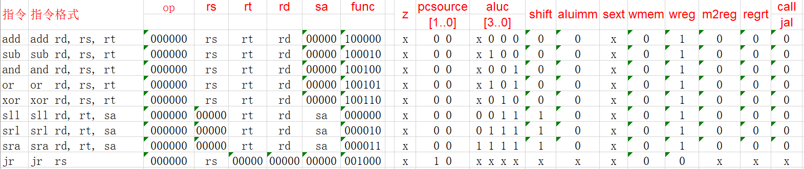
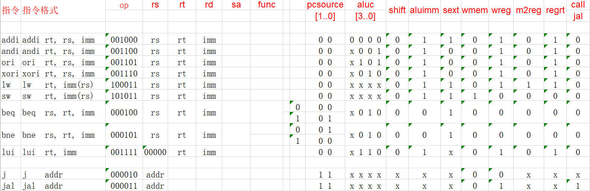
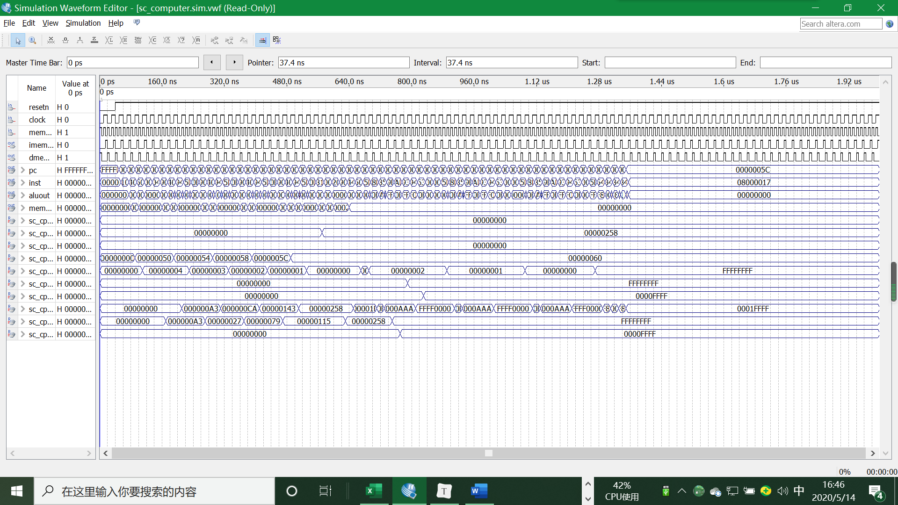
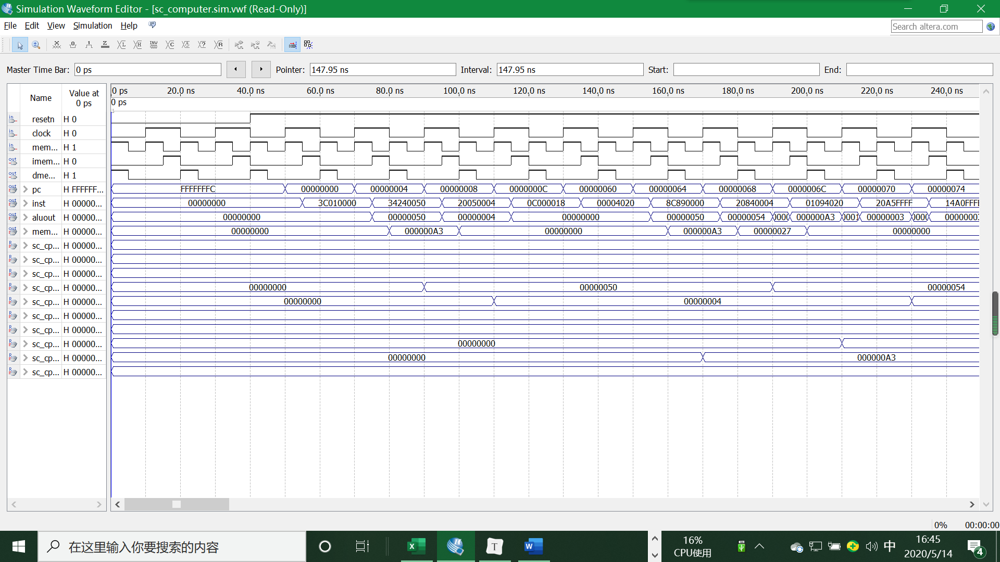
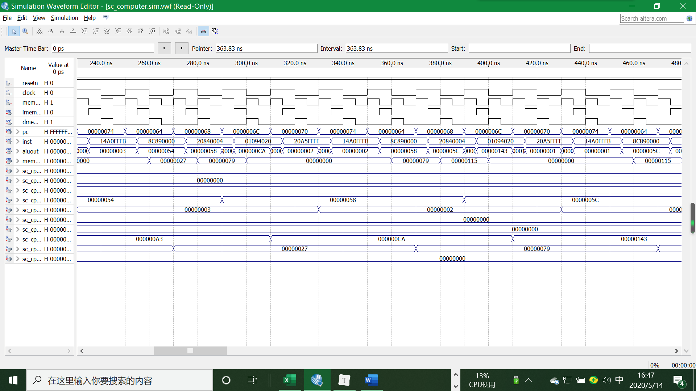
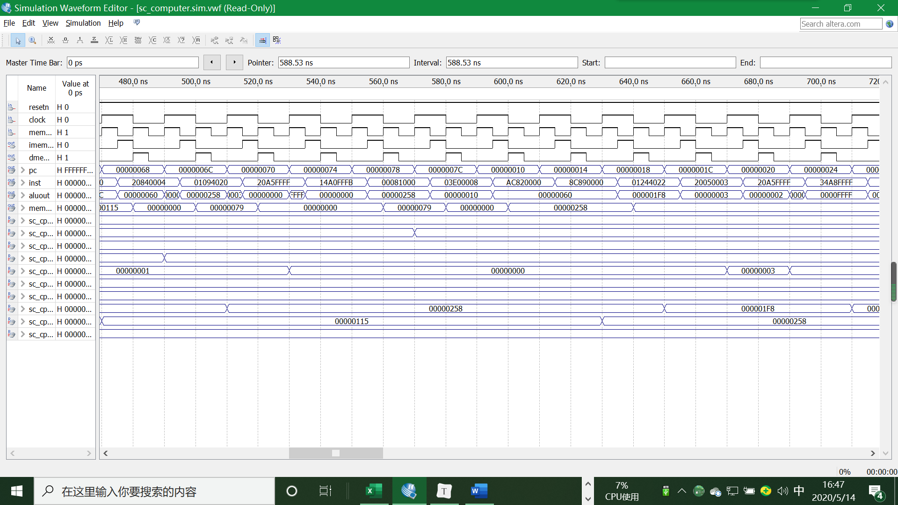
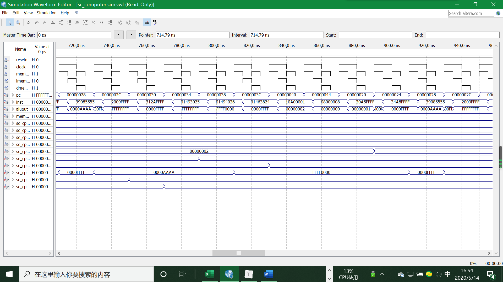
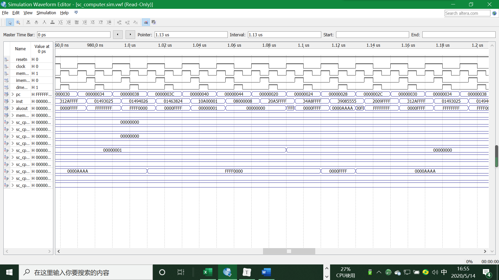
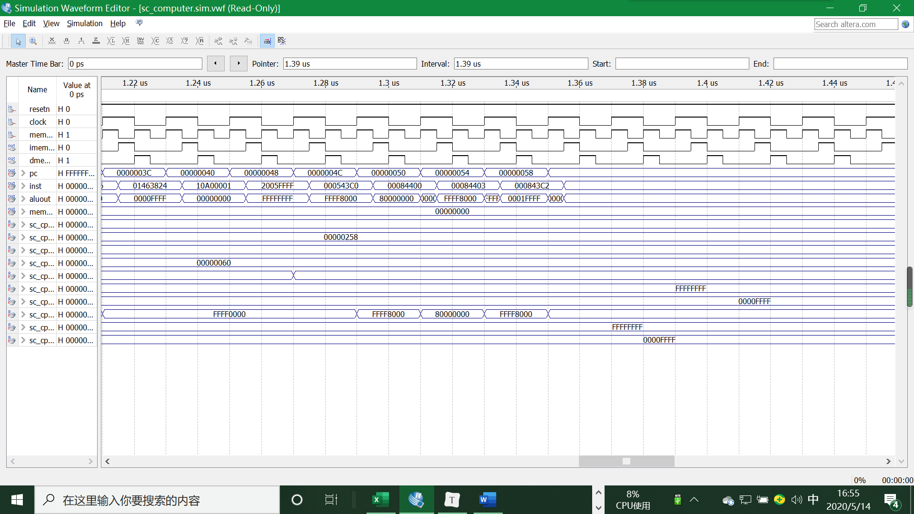
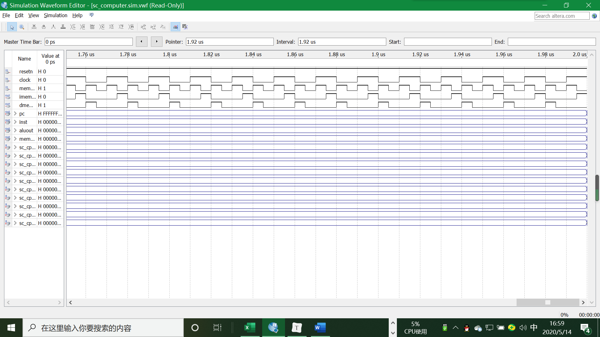

<h2> 单周期CPU设计实验报告</h2>

<h3>设计思路</h3>

<h5> 采用Verilog HDL在quartusⅡ中实现基本的具有20条MIPS指令的单周期CPU设计</h5>

​		老师已经给出了顶层设计和大部分的文件，需要我做的主要有三部分工作，首先填写完善20条指令的真值表，其次，根据真值表完善CU.v文件，生成相应的控制指令，最后完善ALU.v文件，执行相应的计算。参照平时上课内容和指导教材给出的CPU运作原理，我们可以对真值表进行填写。

<h5>填写真值表</h5>

指令可以进行大概分类：

1. 对于只依靠ALU进行二元运算的一系列指令，其数据通路相同，故真值表如下：

   

2. 关于涉及到立即数运算的指令，除去addi指令要额外用到符号拓展之外，剩下部分数据通路也相同，故也容易填写。
3. 通过xor的性质我们可以知道两个相同的数进行异或运算结果为零，反之不为0，因此我们在beq和bne指令的aluc处填上xor的指令。
4. 其余部分的填写可以遵照平时教授的数据通路的建立部分进行填写，真值表余下部分如果图所示：

<h5>填写代码</h5>

​		这次要填写的代码分为两个部分，sc_cu.v定义了各种信号的真值，直接按照上面填写好的真值表进行填写即可。sc_alu.v定义了alu在收到不同的aluc之后的行为表现，结合上表中的aluc的值进行填写。关于一些用到立即数的操作，可以依据给定的sc_cpu.v文件中关于alu_a和alu_b两个变量的定义来完成确定alu模块的输入和数据来源的关系。

<h3>代码实现</h3>

<b>ALU.v</b>

```Verilog
module alu (a,b,aluc,s,z);
   input [31:0] a,b;
   input [3:0] aluc;
   output [31:0] s;
   output        z;
   reg [31:0] s;
   reg        z;
   always @ (a or b or aluc) 
      begin                                  // event
         casex (aluc)
             4'bx000: s = a + b;             //x000 ADD
             4'bx100: s = a - b;       		 //x100 SUB
             4'bx001: s = a & b;             //x001 AND
             4'bx101: s = a | b;    		 //x101 OR
             4'bx010: s = a ^ b;             //x010 XOR
             4'bx110: s = b << 16;	 		 //x110 LUI: imm << 16bit             
             4'b0011: s = $signed(b) << a;	 //0011 SLL: rd <- (rt << sa)
             4'b0111: s = $signed(b) >> a;   //0111 SRL: rd <- (rt >> sa) (logical)
             4'b1111: s = $signed(b) >>> a;  //1111 SRA: rd <- (rt >> sa) (arithmetic)
             default: s = 0;
         endcase
         if (s == 0 )  z = 1;
            else z = 0;         
      end      
endmodule 
```

<b>CU.v</b>

```Verilog
module sc_cu (op, func, z, wmem, wreg, regrt, m2reg, aluc, shift,
              aluimm, pcsource, jal, sext);
   input  [5:0] op,func;
   input        z;
   output       wreg,regrt,jal,m2reg,shift,aluimm,sext,wmem;
   output [3:0] aluc;
   output [1:0] pcsource;
   wire r_type = ~|op;
   wire i_add = r_type & func[5] & ~func[4] & ~func[3] &
                ~func[2] & ~func[1] & ~func[0];          //100000
   wire i_sub = r_type & func[5] & ~func[4] & ~func[3] &
                ~func[2] &  func[1] & ~func[0];          //100010
      
   //  please complete the deleted code.
   
   wire i_and = r_type & func[5] & ~func[4] & ~func[3] &
	            func[2] & ~func[1] & ~func[0];           //100100
   wire i_or  = r_type & func[5] & ~func[4] & ~func[3] &
    			func[2] & ~func[1] & func[0];  		   	 //100101
   wire i_xor = r_type & func[5] & ~func[4] & ~func[3] &
    			func[2] & func[1] & ~func[0];			 //100110
   wire i_sll = r_type & ~func[5] & ~func[4] & ~func[3] &
    			~func[2] & ~func[1] & ~func[0];		   	 //000000
   wire i_srl = r_type & ~func[5] & ~func[4] & ~func[3] &
				~func[2] & func[1] & ~func[0];		     //000010
   wire i_sra = r_type & ~func[5] & ~func[4] & ~func[3] &
    			~func[2] & func[1] & func[0];			 //000011
   wire i_jr  = r_type & ~func[5] & ~func[4] & func[3] &
    			~func[2] & ~func[1] & ~func[0];			 //001000
                
   wire i_addi = ~op[5] & ~op[4] &  op[3] & ~op[2] & ~op[1] & ~op[0]; //001000
   wire i_andi = ~op[5] & ~op[4] &  op[3] &  op[2] & ~op[1] & ~op[0]; //001100
   wire i_ori  = ~op[5] & ~op[4] &  op[3] &  op[2] & ~op[1] &  op[0]; //001101 
   wire i_xori = ~op[5] & ~op[4] &  op[3] &  op[2] &  op[1] & ~op[0]; //001110
   wire i_lw   =  op[5] & ~op[4] & ~op[3] & ~op[2] &  op[1] &  op[0]; //100011
   wire i_sw   =  op[5] & ~op[4] &  op[3] & ~op[2] &  op[1] &  op[0]; //101011
   wire i_beq  = ~op[5] & ~op[4] & ~op[3] &  op[2] & ~op[1] & ~op[0]; //000100
   wire i_bne  = ~op[5] & ~op[4] & ~op[3] &  op[2] & ~op[1] &  op[0]; //000101
   wire i_lui  = ~op[5] & ~op[4] &  op[3] &  op[2] &  op[1] &  op[0]; //001111
   wire i_j    = ~op[5] & ~op[4] & ~op[3] & ~op[2] &  op[1] & ~op[0]; //000010
   wire i_jal  = ~op[5] & ~op[4] & ~op[3] & ~op[2] &  op[1] &  op[0]; //000011
   
  
   assign pcsource[1] = i_jr | i_j | i_jal;
   assign pcsource[0] = ( i_beq & z ) | (i_bne & ~z) | i_j | i_jal ;
   
   assign wreg = i_add | i_sub | i_and | i_or   | i_xor  |
                 i_sll | i_srl | i_sra | i_addi | i_andi |
                 i_ori | i_xori | i_lw | i_lui  | i_jal;
   
   assign aluc[3] = i_sra ;    // complete by yourself.
   assign aluc[2] = i_sub | i_or | i_sra | i_srl | i_ori | i_lui;
   assign aluc[1] = i_xor | i_sll | i_srl | i_sra | i_xori | i_lui | i_beq | i_bne;
   assign aluc[0] = i_and | i_or | i_sll | i_sra | i_srl | i_andi | i_ori;
   assign shift   = i_sll | i_srl | i_sra ;

   assign aluimm  = i_addi | i_andi | i_xori | i_ori | i_lw | i_sw | i_lui;
   assign sext    = i_addi | i_lw | i_sw | i_beq | i_bne;
   assign wmem    = i_sw;
   assign m2reg   = i_lw;
   assign regrt   = i_addi | i_andi | i_ori | i_xori | i_lui | i_lw;
   assign jal     = i_jal;

endmodule
```

<h3>实验结果</h3>

<h5>整体波形图</h5>



<h5>波形图细节</h5>














