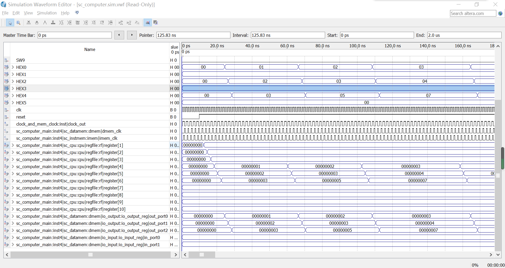
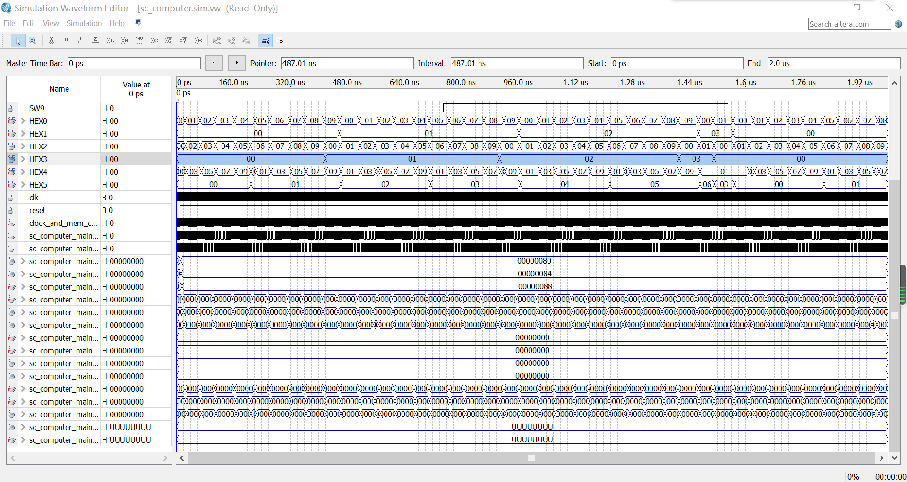
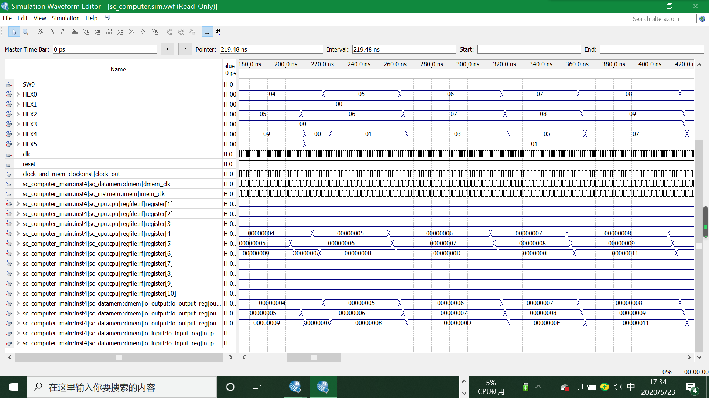
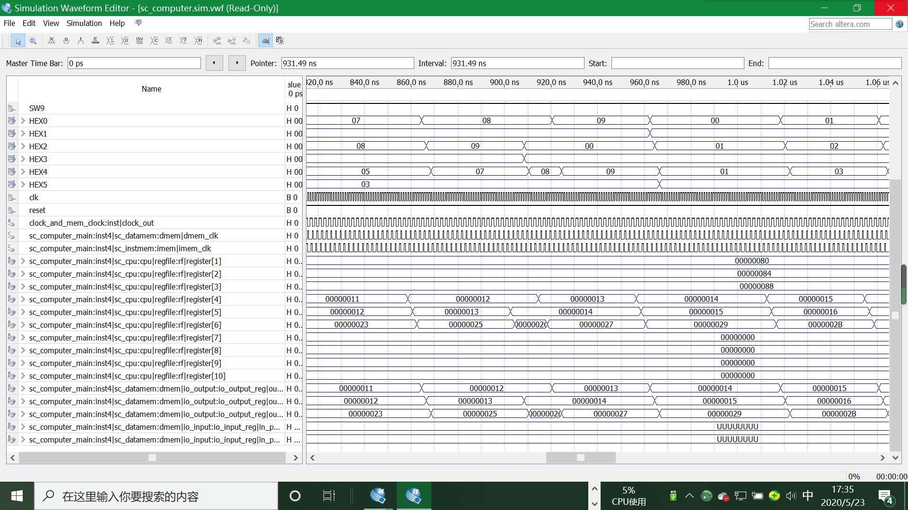

## IO实验报告

#### 设计思路

​		本次实验将在上一次单周期CPU的基础上进行进一步拓展，实现一个可通过IO设备控制的加法器。我们可在sc_datamem.v 模块文件中，通过对输入的 lw 或 sw 指令的地址的判断，实现对数据 RAM 和 IO 控制寄存器组的区分、和分别控制。同时我们需要增加对 IO 的扩展，一是要增加 IO 端口模块，二是要改写数据存储器模块的内部控制逻辑， 增加对内存映射的 IO 地址段的访问功能 。老师已经给出 sc_datamem.v 、io_input.v和io_output.v三段代码，我们首先要新建新建设计sc_computer_main.v并在上次单周期cpu的sc_computer的基础上进行改写，使得IO和CPU内部之间能够建立起数据通道，从而实现用IO控制cpu实现加法器的可能。

```verilog
module sc_computer_main(resetn,clock,mem_clk,pc,Instruction,aluout,memout,imem_clk,dmem_clk,in_port0,in_port1,out_port0,out_port1,out_port2);
   
   input resetn,clock,mem_clk;
   output [31:0] pc,Instruction,aluout,memout;
	output [31:0] out_port0,out_port1,out_port2;
	input  [31:0] in_port0,in_port1;
   output        imem_clk,dmem_clk;
   wire   [31:0] data;
   wire          wmem; 
	wire   [31:0] mem_dataout, io_read_data;
	
   sc_cpu cpu (clock,resetn,Instruction,memout,pc,wmem,aluout,data);
   sc_instmem  imem (pc,Instruction,clock,mem_clk,imem_clk); 
    sc_datamem  dmem (aluout,data,memout,wmem,clock,mem_clk,dmem_clk, out_port0, out_port1, out_port2, in_port0, in_port1, mem_dataout, io_read_data);

endmodule
```

由于IO端的输入是5位零散的二进制输入，二CPU中的操作数是32位的，因此我们需要对输入数据进行整理合并，将两个五位输入变成一个32位二进制数，因此我们编写in_port模块

```Verilog
module in_port(a0, a1, a2, a3, a4, out);
	input a0, a1, a2, a3, a4;
	output[31:0] out;
	assign out = {27'b0, a4, a3, a2, a1, a0};
endmodule
```

同时mem的时钟周期是cpu时钟周期的1/2，因此我们需要对输入的时间信号进行分频，分别用来驱动mem和cpu

```verilog
module clock_and_mem_clock(clk, clock_out);
	input clk;
	output clock_out;
	reg clock_out;
	
	initial
	begin 
		clock_out = 0;
	end

	always @(posedge clk)
	begin
		clock_out = ~clock_out;
	end
endmodule
```

同时输出端口为3个32位二进制数，，我们需要将这三个数个位和十位分别拆开，放入给定的6个HEX当中。原实验设计上HEX用来驱动六个数显进行数字显示，但现今我们没有数显，因此我将每个HEX的七位二进制用来存储一个0-9的整数，进一步用来验证结果。为了将32位的输出个十位拆开并且转化成两个7位二进制数，我们重写out_port_reg模块。

```verilog
module out_port_seg(portnum, ten, one);
	input [31:0] portnum;
	output [6:0] ten, one;
	assign ten = portnum / 10;
	assign one = portnum % 10;
endmodule 
```

最后我们需要定义一个完整的顶层设计，将sc_computer_main以及输入输出转换模块进行连接合并，从而实现一个真正的可以通过外界IO设备进行控制的加法器。

```verilog
module sc_computer(
	clk, reset, SW0,SW1,SW2,SW3,SW4,SW5,SW6,SW7,SW8,SW9, HEX0,HEX1,HEX2,HEX3,HEX4,HEX5,
	pc,instruction,aluout,memout,imem_clk,dmem_clk
);
	input clk, reset, SW0, SW1, SW2, SW3, SW4, SW5, SW6, SW7, SW8, SW9;
	output imem_clk, dmem_clk;
	output[31:0] aluout, memout, pc, instruction;
	output wire [6:0]  HEX0, HEX1, HEX2, HEX3, HEX4, HEX5;
	wire         cpu_clock;
	wire  [31:0] in_port0, in_port1;
	wire  [31:0] out_port0, out_port1, out_port2;
	
	clock_and_mem_clock inst(clk, cpu_clock);
	in_port inst1(SW5, SW6, SW7, SW8, SW9, in_port0);
	in_port inst2(SW0, SW1, SW2, SW3, SW4, in_port1);
	sc_computer_main inst4(reset,cpu_clock,clk,pc,instruction,aluout,memout,imem_clk,dmem_clk,
									in_port0,in_port1,out_port0,out_port1,out_port2);
	
	out_port_seg inst5(out_port0, HEX1, HEX0);
	out_port_seg inst6(out_port1, HEX3, HEX2);
	out_port_seg inst7(out_port2, HEX5, HEX4);
	
endmodule
```

进行如上改动之后，我们就可以进行波形仿真进行验证了。

#### 仿真结果

进行仿真实验时，部分寄存器和中间结果可能会被软件优化掉二没有值，因此仿真时我删掉了sc_datamem中关于in_reg和out_reg部分的波形，同时将out_port的波形加了进来。



通过仿真波形我们可以看出cpu的lw和sw指令运行正常，能够成功将IO输入的部分搬运到内存中，并且能够通过指令搬运到cpu寄存器中进行操作。

现在验证关于HEX的部分，下图中的部分HEX1$\times$10+HEX0 代表一个两位加数，HEX3$\times$10+HEX2代表另一个加数，HEX5$\times$10+HEX4代表结果。我们可以看到加法结果正确，因此本次IO实验设计代码无误。



余下位仿真波形部分细节






 